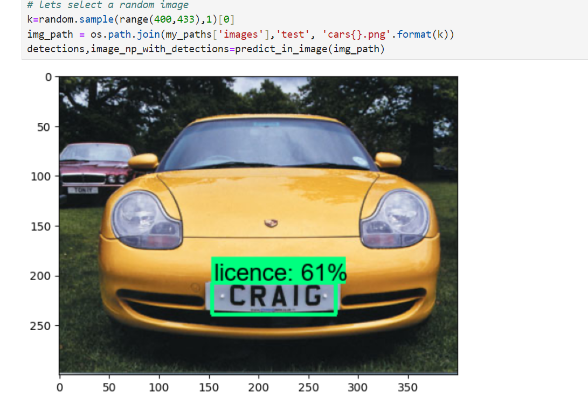
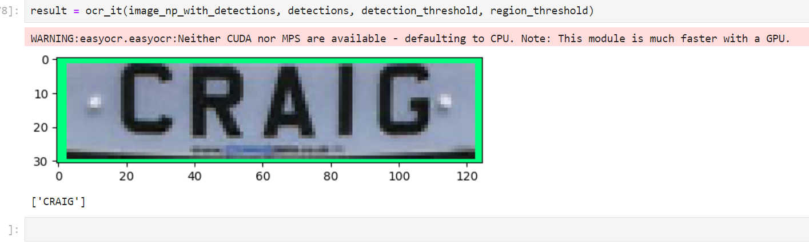

# Automatic-Number-Plate-Recognition-System 

Our model uses the prebuilt ssd_mobilenet_v2_fpnlite_320x320_coco17_tpu-8 model. This model is then fine-tuned on our custom dataset.

The model developed will be able to achieve the following functionalities:
<ul>
<li>Detect a number plate in an image and extract the number from the image by performing optical character recognition.</li>
  
<li>Detect number plates in a real-time recording or video and extract the number from the image by performing optical character recognition.</li>
  
</ul>

<h2>Important links:</h2>
<ul type="disc">
  <li>To download tensorflow object detection API: - <a href="https://github.com/tensorflow/models.git">Click here</a>. Clone it from git into local drives.</li>
  <li>TFRecord generation file: - <a href="https://github.com/nicknochnack/GenerateTFRecord.git">Click here</a></li>
  <li>To download dataset: - <a href="https://www.kaggle.com/datasets/andrewmvd/car-plate-detection/download?datasetVersionNumber=1">Click here</a></li>
</ul>
<h2>Important tools and frameworks used :</h2>
<ol>
  <li>Tensorflow object detection API</li>
  <li>EasyOcr module to perform Optical Charecter Recognition</li>
  <li>Jupyter notebook</li>
</ol>
